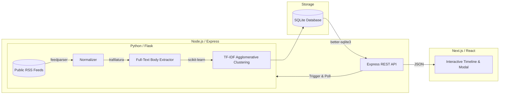

# News Pulse — Topic-Clustered News Timeline

> **Take-Home Technical Assessment Deliverable** for Full-Stack Developer Internship (Xponentium India)

News Pulse is an automated live news ingestion and visualization system. It pulls live articles from major public RSS feeds, normalizes inconsistent feed schemas, automatically groups related stories into cohesive topic clusters using Machine Learning (TF-IDF + Hierarchical Clustering), and presents them on an interactive visual timeline.

---

## 🌐 Live Deployment & Walkthrough

* **Live Frontend URL**: *[Insert Deployed Vercel URL Here]*
* **Live Backend API URL**: *[Insert Deployed API URL Here]*
* **Video Walkthrough (2–3 mins)**: *[Insert Loom / YouTube Unlisted Link Here]*

---

## 🏗️ System Architecture

The project is structured into three decoupled microservices running inside Docker containers with a shared SQLite persistence layer:



### Module Breakdown
1. **`/scraper` (Python 3.11)**:
   * Handles RSS feed parsing, schema normalization, and full-article HTML extraction.
   * Performs TF-IDF vectorization and cosine similarity clustering.
2. **`/backend` (Node.js / Express)**:
   * Serves structured timeline and cluster endpoints formatted specifically for charting libraries.
   * Manages async background ingestion jobs and status polling.
3. **`/frontend` (Next.js 16 / React 19)**:
   * Renders dynamic timeline blocks via `recharts`.
   * Features source toggling, detailed article drill-downs, and real-time ingestion triggers.

---

## 📰 News Sources Ingested

The system pulls live reporting from three major public news feeds across diverse geographic editorial perspectives:

1. **BBC News (World)**: `http://feeds.bbci.co.uk/news/rss.xml`
2. **NPR News**: `https://feeds.npr.org/1001/rss.xml`
3. **Al Jazeera English**: `https://www.aljazeera.com/xml/rss/all.xml`

---

## 🤖 Topic Grouping Approach & Rationale

### Algorithm Choice: TF-IDF + Agglomerative Clustering
Rather than relying on basic keyword overlap count, this pipeline implements **Term Frequency-Inverse Document Frequency (TF-IDF)** vectorization (`scikit-learn`) coupled with **Agglomerative Hierarchical Clustering** using **Cosine Distance**.

#### Why TF-IDF?
* **Domain Noise Reduction**: Standard news articles share heavy boilerplate phrasing (*"breaking news"*, *"reported on Monday"*, *"officials stated"*). TF-IDF naturally downweights common corpus terms while assigning high mathematical significance to rare, story-specific proper nouns (*e.g., "Senate", "Semiconductor", "Diplomacy"*).
* **Hierarchical Grouping**: Unlike $K$-Means which requires guessing the exact number of news topics ($K$) beforehand, Agglomerative Clustering allows setting a strict semantic distance cutoff threshold. Stories that fall within the cosine similarity boundary merge into a cluster; unique outlier stories form standalone timeline markers.

#### Cluster Labelling
Cluster titles are dynamically generated by extracting the top 3 highest scoring TF-IDF feature tokens within the merged cluster documents.

### ⚠️ Known Limitations
1. **Synonym Blindness (Lexical Mismatch)**: Because TF-IDF operates on exact vocabulary term frequencies rather than deep semantic context, two articles covering the exact same event using disparate vocabulary (*e.g., "POTUS signs tax legislation" vs. "President approves fiscal reform bill"*) may fail to cluster together. Overcoming this requires dense neural vector embeddings (e.g., OpenAI `text-embedding-3` or HuggingFace sentence transformers).
2. **Evolving Story Splitting**: Breaking news events that evolve rapidly over 24 hours may shift vocabulary significantly (*from "explosion reported" to "investigation launched"*), sometimes causing a single prolonged news event to fracture into adjacent sequential clusters.

---

## 🚀 Local Setup & Execution

### Prerequisites
* [Docker Desktop](https://www.docker.com/products/docker-desktop/) installed and running.

### 1-Click Launch (Docker Compose)

Open your terminal in the root project directory and run:

```bash
docker compose up --build
```

The services will initialize automatically:
* **Frontend Web App**: [http://localhost:3000](http://localhost:3000)
* **Backend API Server**: [http://localhost:3001](http://localhost:3001)
* **Scraper Microservice**: [http://localhost:5000](http://localhost:5000)

---

## 🔌 API Endpoints Reference

| Method | Endpoint | Description |
| :--- | :--- | :--- |
| `GET` | `/clusters` | Returns all active clusters with article counts and time ranges. |
| `GET` | `/clusters/:id` | Returns detailed metadata and full article lists for a specific cluster. |
| `GET` | `/timeline` | Returns timeline-formatted data. Supports query filtering: `?source=BBC News`. |
| `POST` | `/ingest/trigger` | Triggers a fresh background RSS scrape job. Returns `{ jobId }`. |
| `GET` | `/ingest/status/:jobId` | Returns the polling status (`running`, `completed`, `error`) of an ingestion job. |

---

## ☁️ Deployment Architecture Notes

* **Containerized Orchestration**: Both the Node API and Python Scraper share persistent storage (`/data/news_pulse.db`) via Docker volumes. In production cloud environments, this shared SQLite database can be swapped for a managed PostgreSQL instance by updating `DB_PATH` or connection strings via environment variables without altering core application logic.
